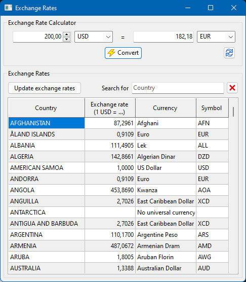

# ExchangeRates
Loads the current exchange rates for all countries from a webservice and displays them in a grid.

The exchange rates are downloaded from https://openexchangerates.org/. An App_ID is required to be able to access this service; it must be entered upon first usage of the program and will be stored for later usage in an ini file. The App_ID can be received after registration at https://openexchangerates.org/signup; the "Free Plan" normally is sufficient which allows for 1000 requests per months.

The list of countries and their currencies is provided by https://www.six-group.com/en/products-services/financial-information/data-standards.html#scrollTo=currency-codes (date: Oct 1, 2021)
